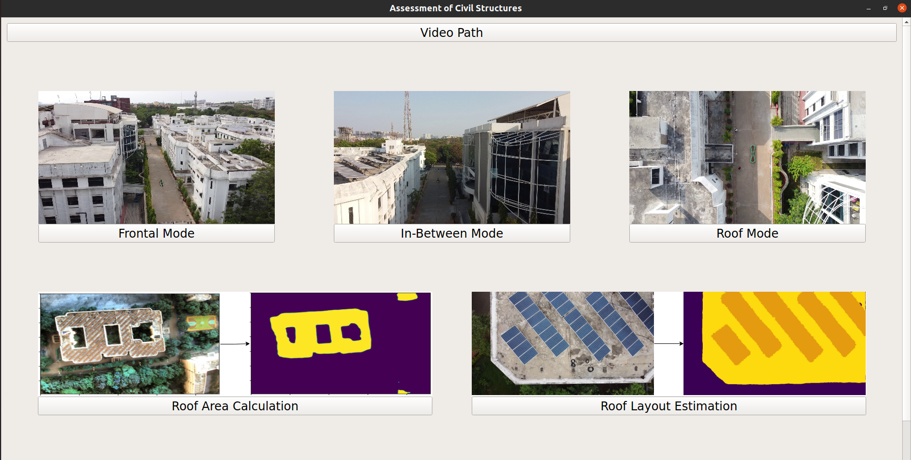
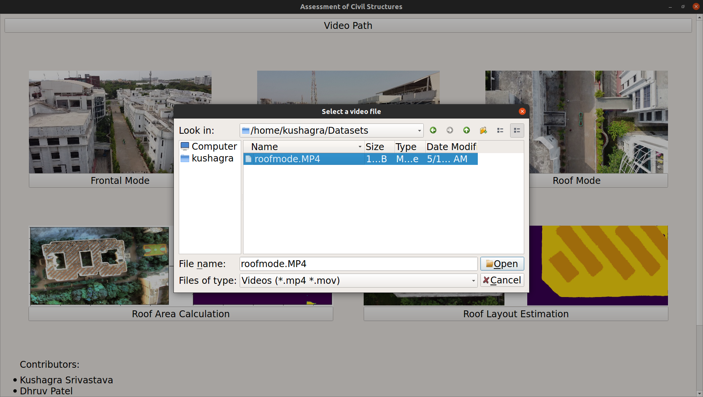
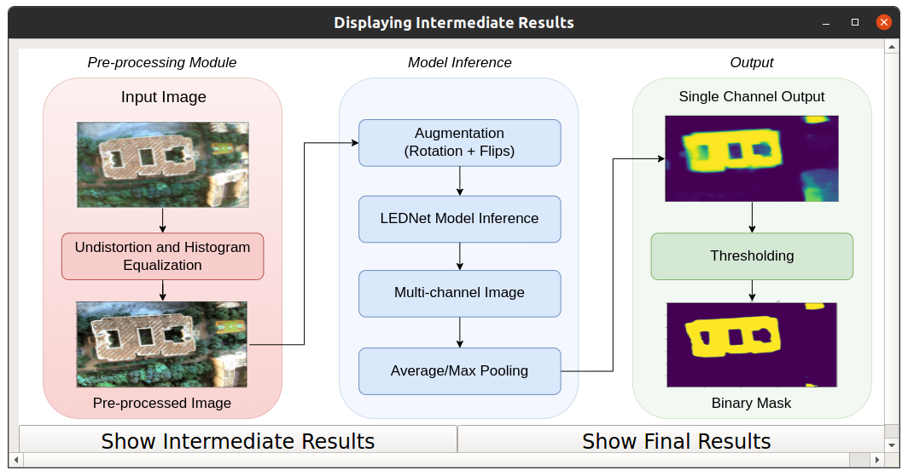

Instructions
============

    
This page covers the instructions as to how to use the software. It is assumed that the user has followed the 
instructions mentioned on the :doc:`previous page <installation>` and has successfully installed the software.
We make use of a GUI Application to run the software. :numref:`gui` shows the layout of the GUI.

.. _gui:

    GUI of the software

The user needs to select the video file to be processed by clicking on the 
*Video Path* option and navigating to the video file as indicated in :numref:`videopath`.

.. _videopath:

    Selecting the video file

.. note::

   The video should be collected as per the instructions mentioned in the :doc:`Data Collection <dataCollection>` 
   section.

Once the video file is selected, the user needs to select the module to be used for processing the video. We have
made provisions to display significant intermediate results of the implemented algorithms (refer :numref:`intermediateresults`). The user may skip to the
final results as well. 

.. _intermediateresults:

    Displaying the architecture of the  Roof Layout Estimation module. The intermediate and the final results can be
    viewed by selecting the respective options.
